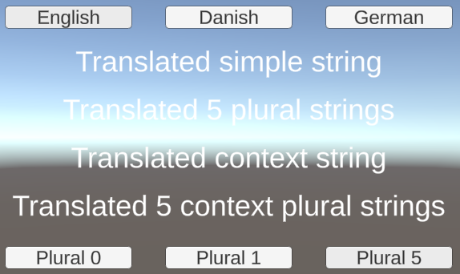

# THE.GetText.Unity

This is a proof-of-concept project of using
[GetText](https://www.gnu.org/software/gettext/) for localization of text in a
Unity project. The code is based on
[GetText.NET](https://github.com/perpetualKid/GetText.NET), with some custom
code for the unity-specific parts. It can localize text of labels on prefabs and
on any *GameObject* in the scenes in the build.

A rough overview of the workflow looks like this, where steps 1 and 2 are
one-time jobs:

1. Install this project as a package*.
2. Set up [Zenject](https://github.com/modesttree/Zenject) to inject an instance
  of *ITranslationManager* during runtime.
3. Add *TranslateLabelString* script to all labels that need to be localized.
4. Push a button to extract strings to a POT file.
5. Localize the POT file, for example by using [PoEdit](https://poedit.net/).
6. Optionally set plural number and format parameters (e.g. character name)
  during runtime.

\*The project is not (yet) set up to be installable as a package.

To see it in action, open the scene *SampleScene* and click the language/plural
buttons:

## Installing the project

This project is not yet ready to be installed as a package in the usual ways, so
to install it you'll need to download the source code and copy it into your
project, along with the **GetText.dll** located in the *Assets/Plugins* folder.

If you do not feel comfortable importing a random *dll* into your project, you
can either use the source code from the
[GetText.NET](https://github.com/perpetualKid/GetText.NET) project, or the *dll*
from the NuGet package that project exposes.

## Set up dependency injection with **Zenject**

Ensure that *ITranslationManager* is added to dependency injection. You can use
*TranslationManager* as the implementation. See the Zenject documentation for
more details on the dependency injection part.

## Add *TranslateLabelString* to *GameObjects*

To mark a label as localizable, you need to add the *TranslateLabelString*
script to the *GameObject*, as seen below:

The message id used to identify a message in the *GetText* files is the text
value of the label, at time of start. The other parameters are as follows:

* **Context**: The *GetText* context (see *GetText* documentation for more
  details).
* **Plural Text**: The default value of a plural string.
* **Plural number**: The default value of the number that determines whether a
  string should be shown as the singular or plural form. Can be changed during
  runtime to reflect the proper value.
* **Format Params Amouns**: The amount of parameters that can be included when
  formatting the string. See details below.

## Extract strings to be localized

To extract strings to be localized, first open the editor window created for
this purpose:

Next, click the *something* button to extract translations into the file
**Assets/Resources/Translations/Assets.pot**:

The tool will iterate all *GameObjects* in all scenes in the build, as well as
all prefabs, and look for any instances of *TranslateLabelString*, and extract
the necessary information from these.

## Perform localizations

To perform a translation, use the tool of your choice - PoEdit is a decent
choice, but tools like CrowdIn should work as well.

## Use string formatting and plural values

You can use string formatting to insert values into the translated strings.
String formatting is done using standard C# formatting, as used by
*string.Format()*. For example, the original string "Hello, {0}" can be
translated into danish as "Hej, {0}", and with a parameter in index 0 with the
value "Zack", the english text would become "Hello, Zack", and the danish text
would become "Hej, Zack". To do this in code, invoke
**SetFormatParamsArgument("Zack", 0)** on an instance of *TranslateLabelString*.

You can use as many parameters as you want, just reference them in the text to
be translated.

To use plural translations, invoke the function **SetPluralNumber(n)** on an
instance of *TranslateLabelString*, with *n* being the number used for plural
determination. Per default, it will also set the first format parameter (with
index 0) to the same value, but you can disable this feature by invoking it with
*false* as the second parameter, e.g. **SetPluralNumber(n, false)**.
